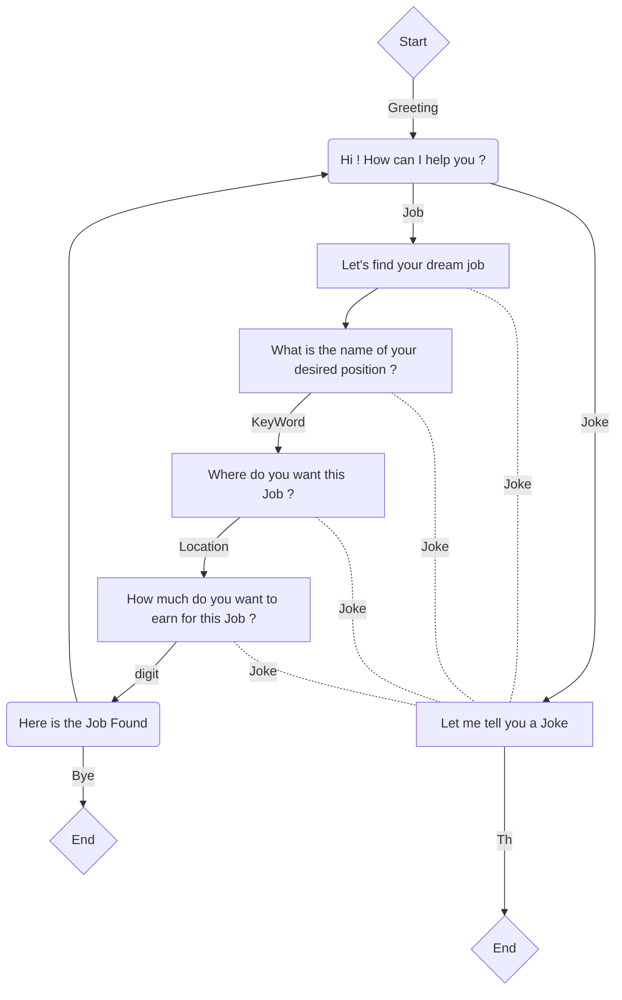

# Groot JobSeeker ChatBot
 

- [📍 Introduction](#-introduction)
- [👩‍💻 Just tell me what to do](#%E2%80%8D-just-tell-me-what-to-do)
- [📝 Some explanations](#-Some-explanations)
- [🎓Developers](#Developers)

## 📍 Introduction

Groot JobSeeker is a chatbot on [discord server](https://discord.gg/X4X372) used to find job opportunities in a country and it can also tell jokes 😂

This chatbot was coded in 🐍 Python language. You can find a source code in the "Project"  folder, and you can see a live exemple in the attached video below.

Groot JobSeeker can respond to five types of conversation :
* Greeting  ⇒ hi, hello, how are you ...
* Ending ⇒ bye, goodbye, thanks ...
* Joking ⇒  tell me a joke, let's laugh ...
* Helping  ⇒  help plz, ...
* Job ⇒  I am looking for a job, find me an intership ...

If Groot doesn't understand any message, it responds with  ***"I am Groot?!"***

Just watch the video below to understand what Groot can do !

]

## 👩‍💻 Just tell me what to do

1. Install all the libraries required to our Groot chatbot using this command :
				`pip install -r requirements.txt`

2. Add a `TOKEN KEY` from discord developers service at the end of the `server.py` file.

3. Open Project folder, run the server file using `python server.py`

4. Go to a Discord server, you will find **Groot JobSeeker** active.
	######  *NB: you should create an account if you don't have one*

5. Start chating with him 💬

## 📝 Some explanations

The architecture of Groot JobSeeker fall into the task-oriented dialog system, it is designed for a particular task (here *Job finder & Telling jokes*). It's set up to get information from the user to help complete the task.
Like the  *Control structure of Frame Based Dialogue System*, it has a set of slots for the job frame that specifies what the system needs to know, then define the values that each slot can take by asking questions of each.
Consider this very simple finite-state control architecture shown in the table below implementing a job finder system asking the user for the information for 3 slots: keyword, location and salary.

Slot | Question
------------- | ------------- 
Keyword| What is the name of your desired position ? ✒️
Location| Where do you want this Job ? 🌎
Salary | How much do you want to earn for this Job ? 💰

***Here is a simple example of our chatbot :***

At first, the speaker have the control of the conversation, then the bot takes control to ask the questions to fill the slot. But, at any time, it can br interrupted to tell a joke and get back on track if it hasn't finished all the slots yet.
***
**Bonus**:
In this project, we added some features to make our chatbot more convenient:
* We added it on a discord server by using the discord developer service.
* We used a NLP python library *"nltk"* to get more synonyms of words to get better reactions of the chatbot.

## 🎓Developers
Students at ESILV. A4 -IBO5 {PROMO 2021}
* Alban STEFF
* Soumaya SABRY
